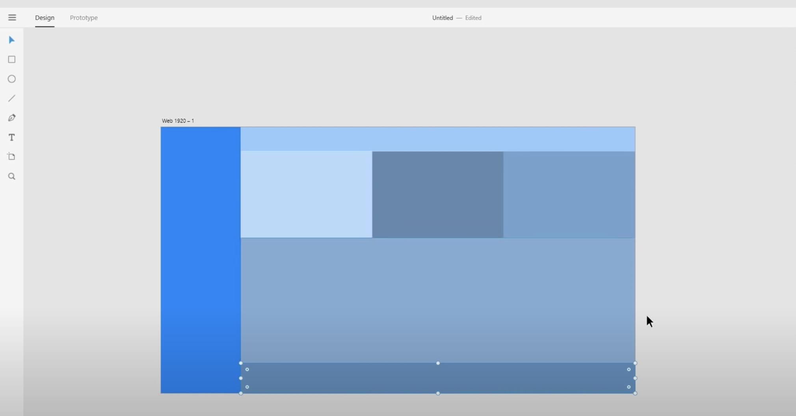
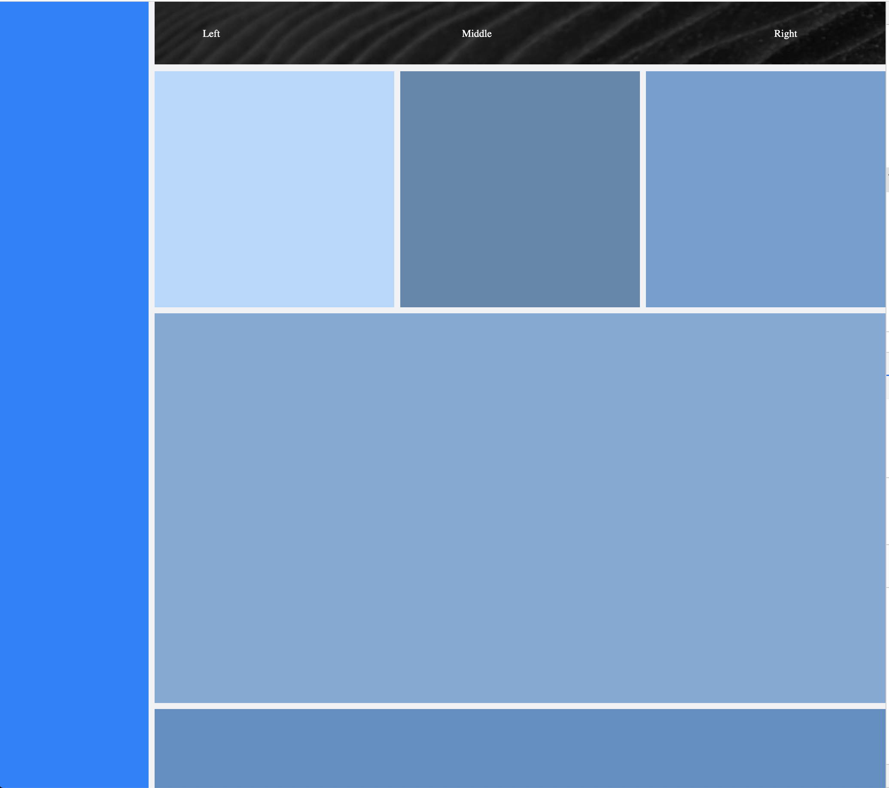

# Getting Started with Create React App

This project was bootstrapped with [Create React App](https://github.com/facebook/create-react-app).

https://origamid.com/projetos/flexbox-guia-completo/#:~:text=Por%20padr%C3%A3o%20ele%20%C3%A9%20row%20%28linha%29%2C%20por%20isso,que%20o%20conte%C3%BAdo%20seja%20apresentado%20em%20coluna%20%C3%BAnica.

## Available Scripts

In the project directory, you can run:

### `yarn start`

### `screenShot`

